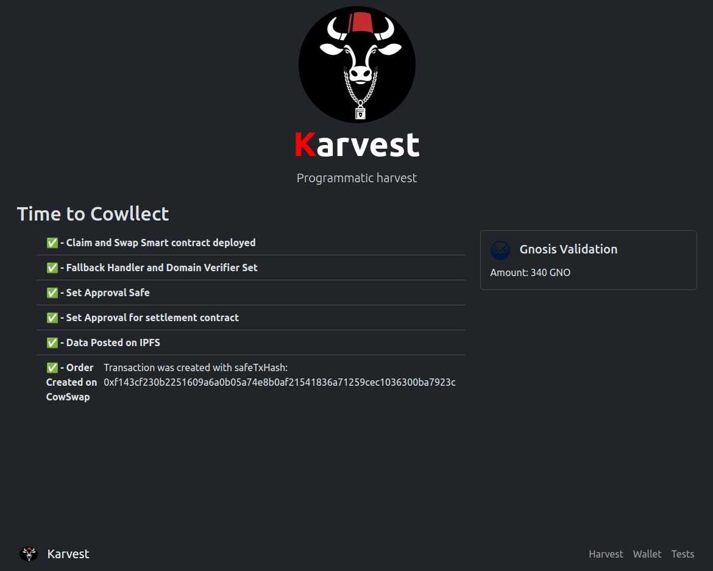

# Claim and Swap

This project combines [CoW Hooks](https://beta.docs.cow.fi/cow-protocol/reference/contracts/periphery/hooks-trampoline) with [Composable CoW](https://github.com/cowprotocol/composable-cow) into a Safe App for the purpose of Claiming/Harvesting Rewards (e.g. Gnosis Chain Validator, or Balancer Staking) and swapping (eventually restaking -- with post hooks) on Cowswap.



## Content

- [app/](./app/): the web app to interact with the Karvest protocol from a Safe or EOA.
- [contracts/](./contracts/): the contracts for the hooked programmatic cow with helpers and claimable contracts.
- [sdk/](./sdk/): the development kit to interact with the Karvest protocol.

## Getting Started

### Safe Web App
An Interface for initializing Claim & Swap

```sh
cd app/
yarn install
yarn start
```

### Contracts

| Contract | Description | Address on Gnosis Chain |
| --- | --- | --- |
| **ClaimAndSwap** | Hooked programmatic cow | [0x35f29f3cb53bddb11b6e286a0454a9224dd3adaa](https://gnosisscan.io/address/0x35f29f3cb53bddb11b6e286a0454a9224dd3adaa#code) |
| **TransferBalance** | Helper for the programmatic cow | [0xD4121d2d90CE7C5F7FB66c4E96815fc377481635](https://gnosisscan.io/address/0xD4121d2d90CE7C5F7FB66c4E96815fc377481635#code)
| **SBCDEpositContractMock** | Example of claim contract: </br> Mock of the beacon chain deposit contract | [0xF07AFCEe9dD0B859edD41603A3D725b70086fEF6](https://gnosisscan.io/address/0xF07AFCEe9dD0B859edD41603A3D725b70086fEF6#code) |

#### Deploy the Claim & Swap Contract

From the contracts directory:

```sh
yarn
yarn hardhat run  scripts/deployClaimAndSwap.ts --network gnosis
```

This contract is deployed and verified at [0x35f29f3cb53bddb11b6e286a0454a9224dd3adaa](https://gnosisscan.io/address/0x35f29f3cb53bddb11b6e286a0454a9224dd3adaa#code). 

It points to the [ComposableCow](https://gnosisscan.io/address/0xfdafc9d1902f4e0b84f65f49f244b32b31013b74) Contract, but uses a [MockSBCDepositContract](https://gnosisscan.io/address/0xf07afcee9dd0b859edd41603a3d725b70086fef6) (for the purpose of the hackathon) which emits WXDAI instead of GNO.

### SDK

[Sample EOA Transaction](https://gnosisscan.io/tx/0xadacb7d0862c0f4f341edcfb4ab9746995ef609bb543cbfbccba62b7ef29824a) generated with `run-eoa`
1. Claims Validator Rewards
2. Swaps (not all but some) for COW token.
3. See the [order in explorer](https://explorer.cow.fi/gc/orders/0xf607a7dff5adf19906db638ebaba314444ba532877548590d4011e5adff628ab7f01d9b227593e033bf8d6fc86e634d27aa855686558d70b?tab=overview).

[Sample Safe Programatic Order](https://gnosisscan.io/tx/0xec82ae8b1661ee357ae36cad487b45e9655fe9310a692f9376bd4c9b3121793f) execution 
1. Claims Validator Rewards
2. Swaps balance for COW token.
3. See [order in explorer](https://explorer.cow.fi/gc/orders/0xb6beda062432020b8f839a197c334752889d95d5a80daf6f16061c93ac992a09608acd7d1c01439b351fefaff7636a136af3da816589bcc6?tab=overview)


Env file requires `PRIVATE_KEY`

```sh
yarn
source .env
```

```sh
# Runs EOA claim and swap
yarn run-eoa
# Create AppData Post and Generate Safe Create Order Params
yarn run create-order-params
```

Currently we create the order via Safe Transaction Builder, but it is web app can invoke this.

### Generate and Post App Data

This library can also - Generate and POST new App Data (something that should happen before order creation via the Safe App). However, these methods are not exposed in script format at the moment. For this, refer to [sdk/AppData.ts](./sdk/src/appData.ts)


The ultimate goal is to implement Post Hooks that can "restake" the claimed GNO. This can be achieved by the user precreating their validator keys and uploading them. The Validator's public key info is needed to invoke the deposit method, but can absolutely be generated via this Safe App / Post Composable Order compatible project.
